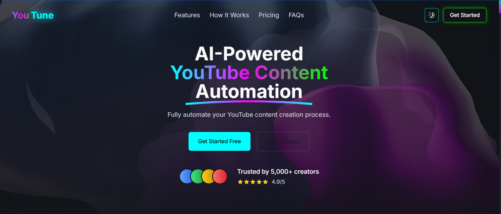

<div align="center">
  <h1> YouTune : a complete end-to-end AI solution for Youtube Content Creation</h1>
  <a class="header-badge" target="_blank" href="https://www.linkedin.com/in/khatoonintech/">
  
  </a>
  

<sub>Author:
<a href="https://www.linkedin.com/in/Khatoonintech/" target="_blank">Ayesha Noreen</a><br>
<small> Agentic AI & Automation Enginer @DevRolin </small>
</sub>
<br>
<br>
<br>
	  


</div>

---


An AI-driven multi-agent automation system that generates video content end-to-end — from idea generation to video creation. This modular pipeline is built using Python and integrates natural language processing, text-to-speech, and media synthesis technologies.

---
## 📚 Table of Contents

* [Overview](#-overview)
* [Project Architecture](#-project-architecture)
* [Requirements](#-requirements)
* [Setup](#-setup)
* [Workflow](#-workflow)
* [Output Structure](#-output-structure)
* [Extensibility](#-extensibility)
* [Troubleshooting](#-troubleshooting)
* [License](#-license)
* [Conclusion](#-conclusion)

---
## 🧠 Overview

This project uses a sequence of intelligent agents to:

1. **Generate a video title or concept.**
2. **Write a detailed script and scene descriptions.**
3. **Convert the script into audio using text-to-speech.**
4. **Compile audio and visual elements into a video.**

The architecture promotes modularity and scalability, making it easy to enhance individual agents independently.

---

## 🏗️ Project Architecture

```
app.py
│
├── Agents/
│   ├── idea_agent.py           # Generates a creative video title
│   ├── scriptagent.py          # Writes script and scenes
│   ├── text_to_speech_agent.py # Converts script into speech
│   └── video_agent.py          # Builds the final video
│
├── Projects/                   # Auto-generated project folders per video
├── requirements.txt
├── .env                        # Environment variables and API keys
└── GEO_AI__.ttf                # Custom font for video generation
```

---
### Core Functionality

* **Agents**:

  * `idea_agent`: Generates a video title or concept.
  * `scriptagent`: Produces a script and scene breakdown from the title.
  * `text_to_speech_agent`: Converts the script into speech audio.
  * `video_agent`: Likely compiles the scenes, audio, and visual elements into a video.

* **Execution Flow**:

  1. Generate a video idea.
  2. Sanitize and create a project directory.
  3. Generate the script and scene prompts.
  4. Convert the script to speech.
  5. Generate the final video.
 
---
## 🔧 Requirements

Ensure you have the following installed:

* Python 3.8+
* [ffmpeg](https://ffmpeg.org/download.html) (for video/audio processing)
* [pip](https://pip.pypa.io/en/stable/installation/)

Install dependencies:

```bash
pip install -r requirements.txt
```

---

## ⚙️ Setup

1. **Clone the Repository**

```bash
git clone [Youtune](https://github.com/KhatoonInTech/YouTune.git)
cd Youtune
```

2. **Configure API Keys**

Update the `.env` file with required API keys (e.g., for LLMs, TTS services, or image generation).

3. **Run the Main Pipeline**

```bash
python app.py
```

---

## 🚀 Workflow

1. **Idea Generation**

   * The `idea_agent` module generates a creative video title based on internal logic or AI prompts.

2. **Script Generation**

   * `scriptagent` generates a structured script and scene prompts from the title.

3. **Speech Synthesis**

   * `text_to_speech_agent` turns the script into a voiceover using a TTS engine.

4. **Video Assembly**

   * `video_agent` combines the voiceover and visuals (images, animations, text) into a final video file.

Each run creates a uniquely named directory under `Projects/` to store artifacts.

---

## 📁 Output Structure

```
Projects/
└── My_Example_Video_Title/
    ├── scripts/
    │   └── My_Example_Video_Title.md
    ├── audio/
    │   └── voiceover.mp3
    ├── scenes/
    │   └── scene_1.png
    └── final_video.mp4
```

---

## 🧩 Extensibility

Each agent is modular and can be replaced or upgraded:

* Swap out GPT-based agents for Claude/Gemini/etc.
* Use ElevenLabs or Amazon Polly for TTS.
* Plug in Stable Diffusion, DALL·E, or Midjourney APIs for scene generation.

---

## 🛠️ Troubleshooting

* **FFmpeg not found?**
  Make sure it's installed and available in your system's `PATH`.

* **TTS errors?**
  Check API key validity and character limits.

* **Agent issues?**
  Each agent can be tested independently for debugging.

---

## 📜 License

MIT License. See [LICENSE](LICENSE) for details.


---
## ✅ Conclusion

This project offers a robust, flexible, and extensible platform for automated video content creation using cutting-edge AI. It is ideal for content creators, marketers, educators, and developers seeking to streamline or experiment with automated media workflows.

Contributions and enhancements are welcome — feel free to fork, improve, and share!

---

<div align="center">
<h3>For any query/help ,please contact our developer:</h3>  
Developer : <a href="https://www.linkedin.com/in/Khatoonintech/" target="_blank">Ayesha Noreen</a><br>
	<small> Agentic AI & Automation Engr @DevRolin </small>
<br> <a href="https://www.github.com/Khatoonintech/" target="_blank"> Don't forget to ⭐ our repo </a><br>


</div>

